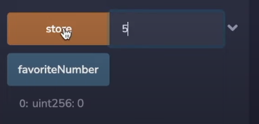

# 004_RemixSolidityBasics

- this whole part is supposed to be done on [remix ethereum](https://remix.ethereum.org/), but i'm doing it locally so i can git save it

- the current version in this tutorial is 0.8.11 but patrick uses 0.8.7

- to compile contracts on vscode instead of remix you can use Juan Blanco extension and install solc through node or use a remote compiler through the extension, just check the settings to make sure it matches your pragma

- to use juan blanco just press f5 when you have all of your contracts in a contracts folder

- you can also compile using solcjs (solc js) which is installed via node

## SolidityBasics.sol

- putting most things in the contract here, mostly just going over types and syntax

- when we say something will be public, I'm mostly referring to remix here
    - 

- the more operations you do the more gas you will be charged

  ### Storage
  
  - there are a few places you can save data in the EVM:
      1. Stack
      2. Memory -- only exists during the function execution
      3. Storage -- exists outside of the scope of the function (like variables unit256 are automatically storage)
      4. Calldata -- like memory, but cannot be modified
      5. Code
      6. Logs
      
   
  
  - in this section we are only talking Memory, Storage, and Calldata
  
  - now when we deploy, the functions will modify the blockchain

## Compiling

- when you compile your code you turn it into EVM Machine Code, 

- many other Blockchains are also EVM compatible

    - like avalanche, fantom and polygon