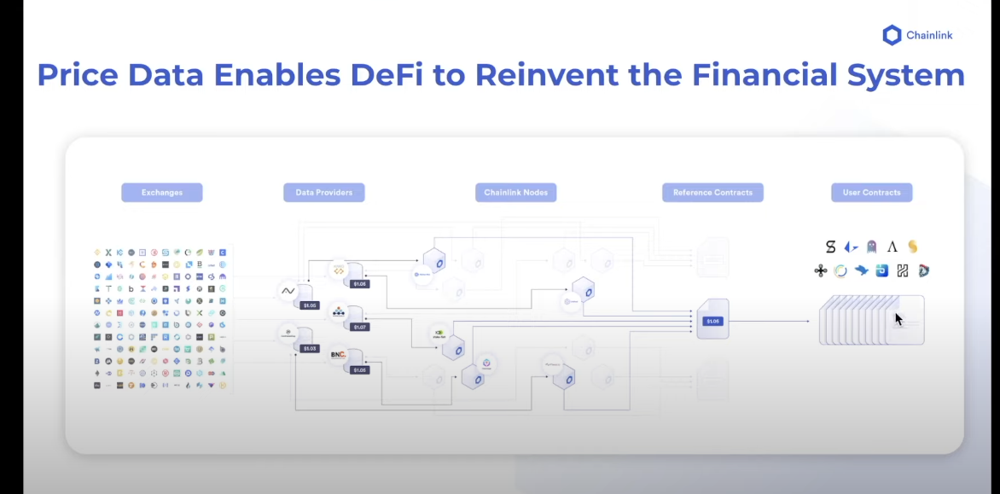
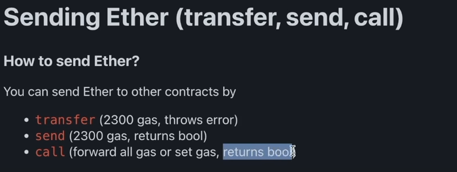
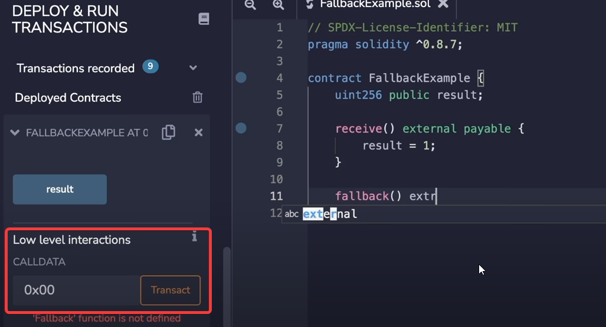

# 006_FundMeExample

- totally new contracts in this section; unfortunately still done in remix but thats fine i guess

    ## Parts of a transaction
    
    > [ ] = changable during send
    > <[ ]> = changeable during send AND function calls
    
    1. **Nonce**: tx count for the account
    2. **Gas Price**: price per unit of gas (in wei)
    3. **Gas Limit**: [21000] 
    4. **To**: <[recipient]>
    5. **Value**: amount of wei to send
    6. **Data**: <[empty]>
    7. **v,r,s**: components of tx signature
    
    ## FundMe.sol
    
    - `payable` means that a function is able to accrue funds
    - `1e18` == 1\*10\*18 or 1 ether
    - `require` keyword makes the transaction revert if a certain requirement (in the ()) is not met
        - when this gets triggered some gas (up until the revert statement, will have been used, the rest gets returned to sender)
    - `msg` keyword helps us interact with things like the funds, the sender, etc
    
    - in this contract, one thing we would like to do is get the value of USD to set a minimum funding amount; we can't do this in the walled (deterministic) garden of ethereum, which is why we need chainlink (or another oracle)
    
    ## Oracles
    
    - oracles are basically the only way to communicate with outside systems
    - they also need to be decentralized
    - if it were just like an `http` api call, then it wouldn't work because different nodes might get different results when proccessing the block (think if the site went down as each node was trying to access the data)
    - to not blow the whole decentralized part of crypto, we need a decentralized oracle as well (otherwise our logic layer is the only thing that is decentralized but our oracle is still open to good/bad manipulation)
    
    <br>
    
    - here is an example of how this actually happens with price data and defi using chainlink
    
    <br>
    
    - 
    
    - for even more on this check out [Chainlink Data Page](https://data.chain.link)
    
    - chainlink works by having people who need the data, pay gas to the operators of chainlink nodes who provide the data
    
    - chainlink has ways to get other things as well, like:
        - price data
        - defi data
        - truly random numbers (chainlink VRF)
        - cron jobs that can trigger when events or times occur (chainlink keeper)
        
    
    ## External Contracts
    - ABI is the same as an (compiled) interface
    - you could take an interface, and provide the contract address and interact with the entirety of the contract
    - you can import the interfaces by literally copying them to the top of your file or by importing them from another contract in your project tree...but these are kinda crazy, we can actually import them
    
    - in our `FundMe.sol` you can see we are attempting to import something that starts with `@chainlink`...
        - this lines up perfectly with the [chainlink github](https://github.com/smartcontractkit/chainlink)
        - notice how the url is identical
            - our contract has `import "@chainlink/contracts/src/v0.8/interfaces/AggregatorV3Interface.sol";`
            - the github link to the `Aggregatorv3Interface.sol` is the github repo, then `/contracts/src/v0.8/interfaces`
        - so basically we are pulling these straight from github
        - these are packaged nicely as well into NPM packages with node
        
        ### Global Variables In Solidity
        
        - just touching on this real quick
            - there are a bunch of
            
            
        <br>
    
    ## Libraries
     
     - libraries are like contracts but they don't have state variables and can't send ether
     
     - all functions in a library are `internal`
     
     - a good example of a library is `SafeMath` which is a library someone else created, but you can (and should) create your own if you frequently are resuing functions
     
     - instead of calling functions normally in the same contract like:
        - `doSomething(object)`
            - we can now do this
                - `object.doSomething()` and the object will be the first param passed in
     
     ### PriceConverter.sol
     
    - notice how this contract starts with `library` keyword instead of `contract` keyword
    
    
    ## Memory Management, Overflow & SafeMath
    
    - before `solidity 0.8.0`, memory was `unchecked`
        - meaning if you tried to assign something like `256` to a `uint8` (which can only hold up to `255`)... you would get overflow and the when checking that variable you would get `0` instead of `256`
    
    - eventually somebody got tired of this happening in solidity and created a `library` called `SafeMath.sol` which checked to see if you were going to end up with overflow causing your type to wrap-around (e.g. a `uint8` going from `255` to `0`)
    
    - in `v0.8.0` of solidity, they added overflow checking and now after a contract is compiled you will get an error if you attempt to overflow or underflow a variable
    
        - you can ignore this if you want by simply using `unchecked {}` and inserting your equation in the brackets as of `solidity v0.8.0`
        
            - i.e. **unchecked**:
                ```
                uint8 public fullVariable = 255;
                
                function add() public returns (uint8) {
                    return unchecked {fullVariable + 1;}
                }
                
                <!-- will return 0 -->
                ```
                
            - i.e. **checked**:
                ```
                uint8 public fullVariable = 255;
                
                function add() public returns (uint8) {
                    return fullVariable + 1;
                }
                
                <!-- will return error because a uint8 doesn't have enough bits to contain 256 -->
                ```
                
    - the only reasons one might use `unchecked {}` are:
        1. **it saves on gas**
            - it's slightly more efficient to use this if you are `POSITIVE` you won't go over the limit for any given data type
            
            <br>
            
        2. **your unique use-case needs the wrap around behavior of an overflowing data type**
        
        
        
    ## For Loops
    
    - in `solidity` for loops look like:
        
        ```
        uint256 currentLoopNumber = 0;
        
        for (uint256 startingIndex = 0; uint256 endingIndex = 101; startingIndex++) {
            currentLoopNumber = startingIndex;
        }
        ```
        - in this example the `currentLoopNumber` will be set 100 times from 0 to 100 (basically like `typescript`)
        
    ## Reseting An Array
    
    - instead of looping through an array and deleting everyone ... i.e:
        ```
        // lets say this array has several elements
        address[] public EthAddresses;

        // this would remove all of them        
        for (uint256 currentIndex = 0; uint256 EthAddresses.length; currentIndex++) {
            EthAddresses.pop[currentIndex];
        }
        ```
        
        - there is an easier way if you just wanted to restart an empty array... i.e:
            ```ts
            // lets say this array has several elements
            address[] public EthAddresses;
            
            // to remove all of them:
            EthAddresses = new address[](0)
            
            ```
            
            
    ## Methods to Transfer Money
    
    - three methods to transfer funds:
        1. **transfer**
            - easiest method:
                ```
                payable(msg.sender).transfer(address(this).balance);
                ```
                - this will automatically revert if something goes wrong
        2. **send**
            - basically transfer without the automatic revert
                ```
                bool sendSuccess = payable(msg.sender).send(address(this).balance);
                
                require(sendSuccess, "error: something went wrong");
                ```
        3. **call**
            - most complicated of the three and basically can do way more than send funds...can seemingly call other functions in other contracts without an ABI
                ```
                (bool callSuccess, bytes memory dataReturned) = payable(msg.sender).call{value: address(this).balance}();
                
                require(callSuccess, "error: something went wrong");
                ```
        - you'll notice in these we put the following:
            - `payable` -- these functions won't work unless we turn `msg.sender` into a payable type
            - `address(this)` refers to the address of the current contract, so when we put `address(this).balance` we are checking the funds balance of the current contract we are inside of
    
        ### Gas Notes
        
        - when using **transfer**, **send**, or **call**, you are going to be using gas in your contract... each method requires the following gas:
            - 
            
            <br>
            
        - **another few interesting notes after doing more gas research:**
            1. each Ethereum block has a limited size of gas it can use (think of each block as having a max gas container size)
                - this changes based on network demand, the target is 15 million gas per block, but it can expand to 30 million gas per block (maximum size of a block)
            
            <br>
            
            2. the gas for a certain thing to happen is usually stated somewhere, for instance:
                - to send an account money from another account via a standard transfer you need 21,000 gas
                - to do a send method in a smart contract you need 2,300 gas
                
            3. the gas limit is somewhat bound, but the gas price can vary completely
            
            4. when you set a gas limit too low, the transaction will literally fail, but will still consume the gas you used
            
            5. if you set a gas limit too high, you will be refunded the unused gas
            
            6. if you set a gas price too low, you will stall the transaction
            
            7. if you set a gas price too high, your transaction will clear very quickly
            
    ## Constructors in Solidity
    
    - work like most other languages, run when the parent is initialized... i.e.:
        - for a Class a constructor is called when you initiate the class
            - e.g. `ClassName NewClass = new Classname()` -- constructor runs
        - for a function a contructor would fire as soon as you called it
            - e.g. `doSomething()` -- construtor is run
            
            
    - to do a constructor in solidity:
        ```
            contract ExampleContract {
                
                address public ContractOwner;
                
                constructor() {
                    ContractOwner = msg.sender;
                }
            }
        ```
        - now when somebody deploys this contract, the `ContractOwner` variable will be set before anything else to the person that deployed the contract
        
            - this might be useful when doing something that requires a withdraw function to a specific address that shouldn't be set by anyone... i.e.:
                ```
                contract ExampleContract {
                    
                    address public ContractOwner;
                    
                    constructor() {
                        ContractOwner = msg.sender;
                    }
                    
                    function withdraw() public {
                        require(msg.sender == ContractOwner, "error: this can only be called by contract owner");
                        
                        payable(ContractOwner).transfer(address)
                    }
                    
                }
                ```
                
    ## Modifiers In Solidity
    
    - modifiers are like pre-made `require` functions that can be added on to a function so that it inherits those `require` statments
    
    - in the example above this (put here again), we use a require statment to ensure that the function `withdraw()` only is callable by the deployer of the contract `ContractOwner`
    
        ```
        contract ExampleContract {
            
            address public ContractOwner;
            
            constructor() {
                ContractOwner = msg.sender;
            }
            
            function withdraw() public {
                require(msg.sender == ContractOwner, "error: this can only be called by contract owner");
                
                payable(ContractOwner).transfer(address)
            }
            
        }
        ```
        
    - instead of writing this a thousand times, we can do a `modifier` like so:
        
        ```
        modifier OwnersOnly {
            require(msg.sender == ContractOwner, "error: this can only be called by contract owner");
            _;
        }
        ```
        
        - with this we can now remove the require line in our function
            
            ```
            contract ExampleContract {
                
                address public ContractOwner;
                
                constructor() {
                    ContractOwner = msg.sender;
                }
                
                modifier OwnersOnly {
                    require(msg.sender == ContractOwner, "error: this can only be called by contract owner");
                    _;
                }
                
                function withdraw() public OwnersOnly {
                    payable(ContractOwner).transfer(address)
                }
                
                function withdrawToSpecificAddress(address _specificAddress) public OwnersOnly {
                    payable(_specificAddress).transfer(address);
                }
                
            }
            ```
            
            - as you can see we made a new function and now instead of writing `require(msg.sender == ContractOwner, "error: this can only be called by contract owner");` in each function, we can just append `OwnersOnly` after `public` to each function
            
    <br>
    
    <br>
            
    -  you might notice the `_;` which represents where the remainder of the code of the function will run
        - if you have it like this:
            ```
            modifier OwnersOnly {
                require(xyz, "error");
                _; //here is where the function starts
            }
            
            function example() public OwnersOnly {
                //require statement will be inserted here
                return xyz
            }
            ```
            
        <br>
        
        - if we had it the other way:
            ```
            modifier OwnersOnly {
                _; //here is where the function starts
                require(xyz, "error");
            }
            
            function example() public OwnersOnly {
                return xyz
                //require statement will be inserted here
            }
            ```
            
            - for this use-case, the second example would be worse because you are choosing to use the gas doing the transaction, before you even know if it can be completed
            
            
    ## Constant Keyword
    
    - basically, if a variable is not going to change after compilation and you KNOW this, you can add the keyword `constant` which saves memory/gas/money (basically makes this more efficient)
    
        - looks like this:
            
            ```typescript
            uint256 public constant CURRENT_ENV = 1;
            ```
            
            - notice the typing convention is SCREAM_SNAKE_CASE
            
    ## Immutable Keyword
    
    - the same as `constant` but can be set during contruction time ... i.e. in a `constructor`
    
        - looks like this:
        
            ```solidity
                uint256 public immutable i_current_env;
            
                constructor() {
                    i_current_env = 1;
                }
            ```
            
    ## Errors
    
    - as of `solidity v0.8.4` we can now use custom error messages
    
    - lets use our `modifier` example that we used before, but lets add an `error` custom type after the `constructor` called `NotOwner`:
        ```diff
            contract ExampleContract {
                
                address public ContractOwner;
                
                constructor() {
                    ContractOwner = msg.sender;
                }
                
                
        -       modifier OwnersOnly {
        -            require(msg.sender == ContractOwner, "error: this can only be called by contract owner");
        -            _;
        -        }

        +       error NotOwner();

        +       modifier OwnersOnly {
        +            if(msg.sender != ContractOwner) {revert NotOwner();} 
        +            _;
        +        }
        
                function withdraw() public OwnersOnly {
                    payable(ContractOwner).transfer(address)
                }
                
                function withdrawToSpecificAddress(address _specificAddress) public OwnersOnly {
                    payable(_specificAddress).transfer(address);
                }
                
            }
        ```
        
    - this saves gas and allows us to reuse our error (which gets more efficient the more we do it)
    
    - `revert` is the same as `require` but `require` requires a conditional statment before the error message i.e.
    
        ```ts
        
        contract Example {
            
            
            modifier RevertExample {
                if(msg.sender != owner) {
                    revert("you must be the owner");
                }
                
                _;
            }
            
            modifier RequireExample {
                require(msg.sender == owner, "you must be the owner");
                
                _;
            }
        }
        
        ```
        
        - additionally notice how the booleans work in each case, the `if statement` works like normal
            - if (not the owner) {
                revert("send this error message")
            }
            
            <br>
            
        - the require actually is saying what it needs to NOT send the message, almost in reverse
            - require(is owner, "if not owner, send this error message")
            
    ## FallbackExample.sol
    
    - here we go over two `special function` in `solidity`:
        1. `recieve`
            - this gets called if someone randomly sends the contract money with NO `CallData`
            
                - on the flip side, if you add data to call data, you will either call a function or get an error
                
                - 
                
                <br>
                
                - you can only have one `recieve` function per contract
                    - it must be `external`
                    - it can't be in a `function`... IT IS a function...kinda like `constructor`
                    - it must be `payable`
                
                
        <br>
                        
        2. `fallback`
            - fallback is called if somebody sends money and sends `CallData` that isn't recognized (maybe to a non-existant function)
            - this must also be `external` and `payable` and must not be in a `function` just like `recieve`
            
            
    <br>
            
    - basically these `special functions` (`recieve` and `fallback`) get called only when someone sends money along (aka they are trying to do something) with no function or an invalid function (or call data)
    
    - you wouldn't just send money along to a contract that goes nowhere or isn't designed to hold it, these prevent that or atleast manage it
    
    - if you don't have a `receive` function and only have a `fallback` function, then the `fallback` function will be called instead when no `CallData` is sent
        - this does not work the other way around, if you have a `receive` function but no `fallback`, then `receive` will be used when no `CallData` is sent, but the contract will error out if some `CallData` is sent
    
    - you should atleast have a `fallback`, otherwise calls to your contract may just error out with no information
        
    - so basically in our `FundMe.sol`, we can call `fund()` inside our `fallback()` so when people accidentally do the wrong thing, they still can store their funds and their address gets recorded so we know they funded it
    