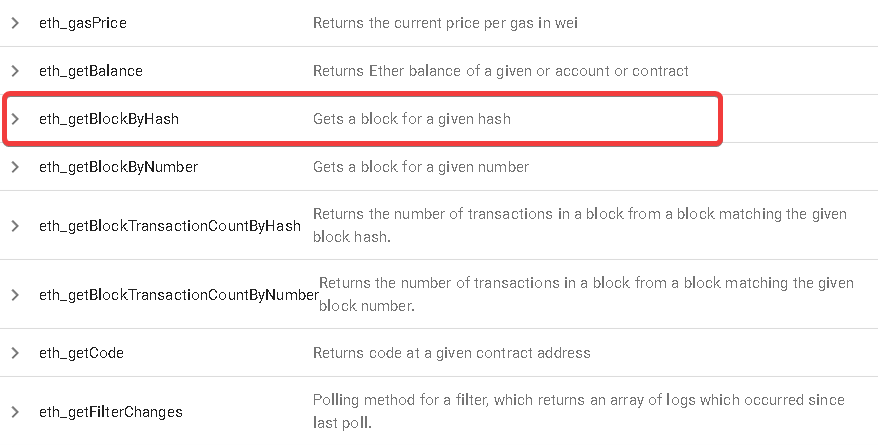
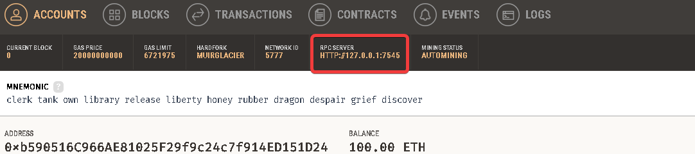
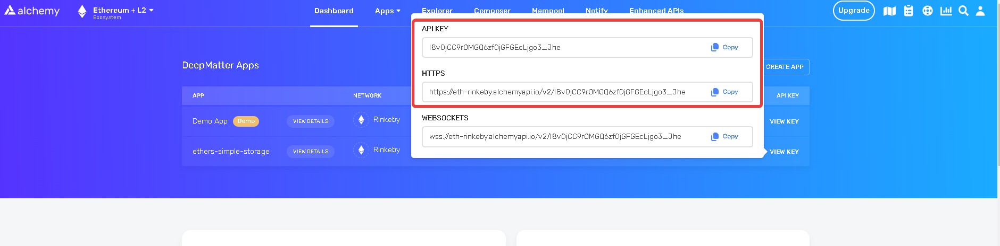
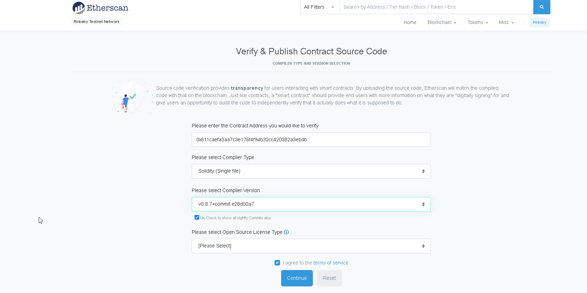

# 007_HardHatEnvironment

- starts around **00:06:19**
    - should line up with `Lesson 5: Ethers.js Simple Storage` on the github
    - so far a toooooooooooooooooon of this is wasted time
        - only learned really about formatting extensions for solidity
        
    
    
## Node, NPM and Windows
- patrick decides to use yarn and linux (totally fine) but I'm just gonna run on Windows Git Bash and NPM (just easier than connecting remote and NPM is probably going to out-scale Yarn with Microsoft and Github Integration)

- we install `solc` -- i think the versions of solc line up with current sol compiler
    - it seems `solc` and `solc-js` are the same thing
    
- again, patrick is setting up a little different, I chose to install solc globally (which is what they suggest in documentation -- `npm i -G solc`) to use command line commands
    - in your cli, type `solcjs --help` to ensure this is in your `PATH`
    
    ## SolcJS CLI
    
    - to compile with solcjs, type:
        - `solcjs --bin --abi --include-path ./node_modules/ --base-path . -o ./output ./contracts/SimpleStorage.sol` where:
            - `--bin`               creates the binary
            - `--abi`               creates an abi
            - `--include-path`      includes your local node modules
            - `--base-path`         sets your current directory as the root of this command
            - `-o`                  sets where the files will be output
            - `SimpleStorage.sol`then finally we put what file to compile
            
    
    
## SimpleStorage.sol

- we are just copying the same `contract` from several sessions ago


## Ganache and Truffle

- get Ganache from Consensus, which is like a local Psuedo-Blockchain GUI


## Ethers.js

- whenever you connect to a new blockchain, you will need to know the `RPC URL` or Remote Procedure Call, Uniform Resource Locator to connect to a node
   
    - an example of this could be Rinekby which has a `RPC URL` that points to `https://rinkeby.infura.io/v3/`
    
    - you could always create your own node by running something like [go ethereum / geth](https://github.com/ethereum/go-ethereum)
    
        - using `geth` you would expose an `RPC URL` by using a flag like `--http.addr 0.0.0.0` and then it would be running on your local machine
        
    - lets say you do this in this, how do you interact with your node? well, ethereum has an [api](https://playground.open-rpc.org/?schemaUrl=https://raw.githubusercontent.com/etclabscore/ethereum-json-rpc-specification/master/openrpc.json&uiSchema%5BappBar%5D%5Bui:input%5D=false&uiSchema%5BappBar%5D%5Bui:title%5D=Ethereum%20JSON-RPC%20API/)
    
        - with this api, you can do things like `eth_getBlockByHash` which will return a block number if you give it a `hash`
            
            - ;
    
    - in our `deploy.js` `main` function, we could totally just give a `RPC URL` and interact with each API endpoint, but that would be a lot of reinventing the wheel....
        
        - fortunately, things like `Ethers.js` have abstracted much of this away and created easy to use wrappers for many of the endpoints to more quickly integrate
        
            - `ethers.js` is tooling for blockchains that are `EVM-Compatible` that wrap a bunch of api calls that would be tedious into simple to use method calls that can be implemented quickly
            
            - ethers.js is behind the hardhat enviornment and so here we just `npm i ethers`
            
## Deploy.js

- now we simply import ethers and then add:
    
    - `const provider = new ethers.providers.JsonRpcProvider();` and in the `()` put the `RPC SERVER` address that you see at the top of ganache
    
        - 
        
    - next, to work with a wallet inside ganache, you could assign it to a variable:
        
        - `const wallet = new ethers.Wallet("9d4618024a3140b8c658ccabc1f4606030c3de6240c24e4b7cecabef50865eb0", provider)`
        
        - the number in the wallet is the private key assosciate with the wallet (remember private key -> public key... i.e. you can always get your public key from your private key, which is why this works)
        
    - now we need to read the `ABI` and `BIN` files we created earlier using `solc`:
    
        ```ts
        const abi = fs.readFileSync(
            "./output/contracts_SimpleStorage_sol_SimpleStorage.abi",
            "utf8"
        );

        const bin = fs.readFileSync(
            "./output/contracts_SimpleStorage_sol_SimpleStorage.bin",
            "utf8"
        );
        ```
        
    - now we can create a factory to create these contracts:
        ```ts
        const abi = fs.readFileSync(
            "./output/contracts_SimpleStorage_sol_SimpleStorage.abi",
            "utf8"
        );

        const bin = fs.readFileSync(
            "./output/contracts_SimpleStorage_sol_SimpleStorage.bin",
            "utf8"
        );
        
        const contractFactory = new ethers.ContractFactory(abi, bin, wallet);
        ```
        
    - and finally we can use that to deploy our contract
        ```ts
        const main = async () => {
        const provider = new ethers.providers.JsonRpcProvider(
            "HTTP://127.0.0.1:7545"
        );
        const wallet = new ethers.Wallet(
            "9d4618024a3140b8c658ccabc1f4606030c3de6240c24e4b7cecabef50865eb0",
            provider
        );

        const abi = fs.readFileSync(
            "./output/contracts_SimpleStorage_sol_SimpleStorage.abi",
            "utf8"
        );

        const bin = fs.readFileSync(
            "./output/contracts_SimpleStorage_sol_SimpleStorage.bin",
            "utf8"
        );

        const contractFactory = new ethers.ContractFactory(abi, bin, wallet);

        const contract = await contractFactory.deploy();
        console.log(contract);
        };
        ```
        
        - you should also see some ethereum used in the `address` you used when defining `wallet` (basically you should see a little less ether in that ganache account)
        
        - since we `console.log`ed the contract, you should also see the `contract object` in your console
        
        - you will also see it in the `transactions` tab of `ganache`
        
        
        - if we want to add more data to this contract, we can do so in the `overrides` of the `.deploy` function of the `contractFactory` for example:
        
            ```ts
            const contract = await contractFactory.deploy({
                gasPrice: 1000000000,
                gasLimit: 21000,
            });
            
            ```
            
        - we could also do something like this where we wait for a block to complete as a receipt that the transaction is good:
            ```ts
            const contractFactory = new ethers.ContractFactory(abi, bin, wallet);

            const contract = await contractFactory.deploy();
            console.log(contract);

            const deploymentReceipt = await contract.deployTransaction.wait(1);
            console.log(deploymentReceipt);
            ```
            
            - odds are the receipt will be more helpful to you as it contains more helpful quick info like:
                1. to
                2. from
                3. confirmations
                4. transactionHash
                5. etc, etc
                
    ### Raw Transaction
    
    - wrote most of the notes for this one inside `deploy.js` so just look there at the `info:` comments
    
    - basically we can compose this contract ourselves without `ethers.js`, but it's hard, here we write it out
    
    - `chainId:` is a section to input the Id of the chain you are working with, if you go into metamask you will notice each 
    
    > **because this is now pretty convoluted, i moved it from `deploy.js` to `deploy.js.old`**
    
    
    ### Building out other functions to Interact with Contract
    
    - Here we build out some functions to actually interact with the contract
    
        - an example is like a button to retrieve our favorite number (kinda like how remix works with the automatic buttons with public variables)
        
    - to see kind of what we have to build out, you can look at the abi
    
        - it's probably jumbled, but you can copy/paste it into a new `.json` file and can format it to read it better
        
    - with just a binary file `.bin` you can't really decompile very easily what has been done, that's why having the `ABI` is kind of important...its kind of like the documentation to a complicated API
    
    - on our first function `currentFavoriteNumber` we get back a `BigNumber` which is a type implemented by ethers because of floating point errors in `js`
    
        - when you see this type, it's better to convert to string to read it... i.e. `toString()`
        
        - when passing variables to functions, it's better to use strings with ether and ethers.js
        
    - make sure you are looking at `deploy.js`
    
    ### Environment Variables
    
    - here patrick basically talks about `.env` files and explains why you should use them
    
        - make sure you put **ALL KEYS** in `.env` files
        
    - added a `.gitignore`, `.env` and `example.env` to `deploy.js`
    
    - but what if we want even safer:
    
        - instead of storing our stuff in a `.env`, we can encrypt it first
        
        - patrick goes over how to do this, but it does make the process take quite awhile longer and isn't really necessary for this tutorial
        
            > **before you create git repos that might actually have information that could be hacked and create a **GIANT** problem (like database passwords or private keys or ssh keys, etc etc) MAKE SURE you have a system to actually encrypt them; for the creator of these notes, it should not be a problem**
            
            > ** just remember, bigger entities will definitely go over and above to protect this stuff, so don't feel odd if your strategy isn't listed anywhere or is kind of abstract -- at the moment I'm thinking you would never have private keys on a development project, but if you did, you would want them encrypted on whatever server you were running and a method to pull them out that couldn't be reversed engineered using sha/aes to make sure only malicious parties actually working at the company could access them**
            
            > ** OBVIOUSLY IN THEORY, this can be ultra-complex, but really shouldn't be too much of a problem until you get to a larger scale where you have a trust hierarchy of people...at a local level, feel free to write an encryption password on a sheet of paper or something so long as you take steps to actually back that up safely (steel plate or several encrypted usbs or whatever) -- alright rant over :)
            
            
## Alchemy

- we could run our own node to connect to blockchain, but instead we are going to use [Alchemy](https://alchemy.com)

    - `Alchemy` is a `NaaS` or `Node as a Service`
    
    - Once you have a probject, you can click to view the keys to it...all we need for this project is the `API KEY` and `HTTPS`
    
        - 
        
    - next we need to go to something like metamask (a web3 wallet) and grab a private key to actually use with this
    
    - to continue with the tutorial, the account will need actual money
    
    - we attempt to publish here using our metamask with the rinkeby eth and our node on alchemy AND you can now see the code on [rinkeby etherscan](https://rinkeby.etherscan.io/verifyContract?a=0x611caefa3aa7c3e176f4f94b32cc420382a3ebdb)
    
    
    ### Verifing & Publishing Your Contract Source Code
    
    - a cool feature of [etherscan.io](https://etherscan.io) is that you can upload your source code and etherscan can compare the compiled version of the code you submitted to the compiled code on the blockchain, if they match, etherscan will publish that information and the source code so more users trust the contract you created for what it does
    
        - 
        
    - now when you go to the [contract](https://rinkeby.etherscan.io/address/0x611caefa3aa7c3e176f4f94b32cc420382a3ebdb#code), you can see that we have verified this source code and now anybody thinking about interacting can go ahead and ensure that they want to by double checking our source code for red flags
    
    
    ### Mempool
    
    - the mempool is like a waiting room of a node for a transaction to clear 
    
    - developers must use nodes (like `alchemy` or another RPC provider/NaaS) to make requests to the blockchain
    
    - each node contains a copy of the blockchain state AND a local memory of transaction data (mempool)
    
    - when you see on `alchemy` in the mempool tab that a transaction is pending, you will also see it pending in `metamask`; same for complete and failed
    
    - if something is stuck in pending, you can get more information as to why in this tab, it could be because you didn't include enough gas or that some data was missing