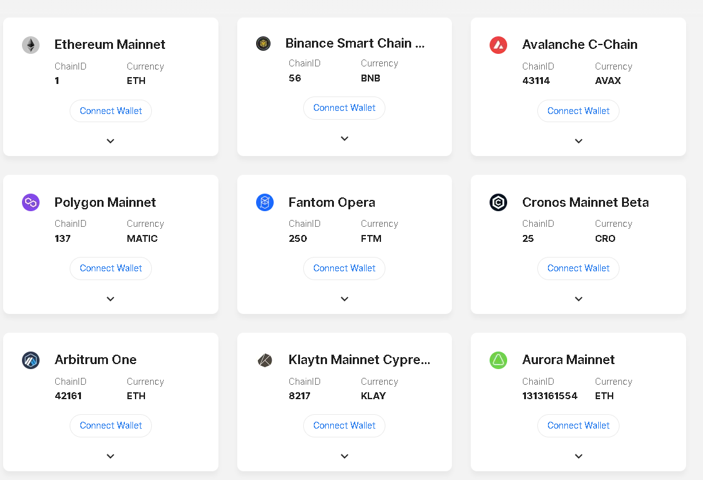

# 008_Lesson6HHSimpleStorage

- in this lesson we finally start using [`HardHat`](https://hardhat.org/)

- `@` in a `node_module` is a `scoped package`, which allow NPM packages to be namespaced
    - basically lets say you have a company like Facebook, and you want to release a bunch of opensource facebook packages, well if something like `http` is already taken as a NPM module, you could do `@Facebook/http` and still get it, then you know anything that follows `@Facebook` is an official package from Facebook
    
    - `scoped packages` are not necessarily public so the search can be a little wonky i.e. some can choose not to show up
    
    ## HardHat Sections
    
    - to start a new hardhat project, you simply type `npx hardhat` or yarn equivalent
    
    - after doing so you will get several new folders and files:
        1. **contracts/**: contains all your `.sol` files
        2. **scripts/**: contains your scripts for things like deploying contracts and things like `npx hardhat run <script>` commands
        3. **test/**: a folder containing your tests for testing contracts
        4. **hardhat.config.js**: entry point for all our scripts, a config file for hardhat
        5. **artifacts/**: only exists after you do `npx hardhat compile` and it's where some of that gets output
        6. **cache/**: only exists after you do `npx hardhat compile` and it's just a cache of whats been compiled
        
    - now if you run `npx hardhat` again, you will get a prompt with tasks like `npx accounts` because you have that `hardhat.config.js` file (basically hardhat knows you are now actually in a project) 
    
        - **side note here: note that hardhat will look at the parent directory for this file too, and if it finds one, might be using that, so ensure you have one in the directory you are working on**
                
    <br>
    
    ## SimpleStorage.sol
    
    - lets remove the `Greeter.sol` that comes default in HardHat and replace it with our `SimpleStorage.sol`
    
    - **you can change the HardHat Solidity Compiler Version in the `hardhat.config.js` at the bottom in the `module.exports` area**
    
    - now if you recompile with `npx hardhat compile` you should see the compiled contract in `./artifacts/contract/SimpleStorage.sol`
    
    <br>
    
    ## Scripts
    
    - our first script is going to be a `deploy.js`... this will be in the `scripts/` dir
    
    - note we used the `ethers` package from `hardhat` this time instead of directly from `ethers.js`, this is important for `hardhat` to connect some dots between contracts so dont import from `ethers`
        - `import { ethers } from "hardhat";`
        
        - a good example of this is the first new line of our `deploy.js` script:
            ```ts
            const SimpleStorageFactory = await ethers.getContractFactory(
                "SimpleStorage"
            );
            ```
            - as you can see we have simplified how easy it is to make a Contract Factory with Hardhat, but if we didn't import `ethers` from `hardhat` it wouldn't know about the `contracts` directory, so it couldn't even find `"SimpleStorage"`
            
    - check out the `./scripts/deploy.js` to see all the changes that make HardHat easier
    
    - finally, you can run scripts by using `npx hardhat run <script location>`
        - so in our case it's `npx hardhat run ./scripts/deploy.js`
        
    - if you don't specify an RPC URL, hardhat will automatically deploy it to hardhat local network, this can be changed in your `hardhat.config.js` from `defaultNetwork: 'hardhat'` to whatever you want in the `module.exports` object
    
    - you can define additional networks in the `module.exports` object as well, like so:
        ```ts
        module.exports = {
            solidity: "0.8.8",
            defaultNetwork: "hardhat",
            networks: {
                rinkeby: {
                    url: process.env.RINKEBY_RPC_URL,
                    accounts: [process.env.PRIVATE_KEY_1],
                    chainId: 4,
                },
            },
        };
        ```

        - where now if you specify a flag for `rinkeby`, then hardhat will use that, if no flag is provided, it will use the default hardhat option that you set with `defaultNetwork`
        
        - the `chainId` is 4 because that is the EVM chain associated with `rinkeby`, you can see a list of the chainId [here](https://chainlist.org/), image of this site below:
            - 
            
        - finally to deploy to `rinkeby` with `npx hardhat run ./scripts/deploy.js --network rinkeby`
        
    <br>
    
    ## Auto-Verify Contract Source Code on Etherscan
    
    - we use the [etherscan.io](http://etherscan.io) api to automatically verify our contracts, other block explorers probably have similar programatic verification methods via api, but with etherscan being the biggest plaform, we are focusing on it
    
    - fortunately, Hardhat has [plugins](https://hardhat.org/plugins), and they even have [a plugin for etherscan](https://hardhat.org/plugins/nomiclabs-hardhat-etherscan), which makes it so we don't have to do really any api programming
    
        - to use it, you just `npm i -d` the dependency, and then add `require("@nomiclabs/hardhat-etherscan");` to the top of your `hardhat.config.js`
        
        - lastly, we need to add it to our `module.exports` with our `.env` (because its password-like data):
            ```ts
            module.exports = {
                solidity: "0.8.8",
                defaultNetwork: "hardhat",
                etherscan: {
                    apiKey: process.env.ETHERSCAN_API_KEY,
                },
                networks: {
                    rinkeby: {
                        url: process.env.RINKEBY_RPC_URL,
                        accounts: [process.env.PRIVATE_KEY_1],
                        chainId: 4,
                    },
                },
            };
            ```
            
            - now you should have a new task when running `npx hardhat` called `verify` -- which got added because Hardhat scanned our plugins in our `module.exports` and `imports` and found that that plugin adds that task...but we don't want to have to continue to run it from the command line because thats a pain, so we are going to build the function right into our deploy script
            
            - to do this we import `run` from `hardhat` in our `deploy.js` script:
                ```ts
                const { ethers, run } = require("hardhat");
                ```
                
            - `run` allows us to run any of the tasks in `npx hardhat` menu, directly in our script
            
            - so now in our function we have:
                
                ```ts
                async function verify(contractAddress, args) {
                    console.log("verifying contract...");
                    await run("verify");
                }
                ```
            
            - we can see what other arguments we need to include, by just running `npx hardhat verify --help` in our command line...after looking at it, we see we can only pass the `verify` parameter
    
                ```ts
                async function verify(contractAddress, args) {
                    console.log("verifying contract...");
                    await run("verify:verify", {
                        address: contractAddress,
                        constructorArguments: args,
                    });
                }
                ```
                
                - as you can see the second verify gets added with `:verify` which is like a subtask, then in the second param we can pass other arguments as an object
                
                - then we add a `try...catch` block just to make sure that we handle the case that the contract is already verified either automatically by etherscan or by you already deploying this (etherscan constantly monitors identical bytecode to try to auto-verify as much as possible)
                
                - finally we implement it into our `main()` function, but first use `chainId` to only verify if we are on a valid network (like, we don't want to verify if we are running locally on hardhat, because we literally can't [no hardhat.etherscan.io])
                
                    - to do this we import network:
                        ```ts
                        const { ethers, run, network } = require("hardhat");
                        ```
                        
                - and add the logic
                    ```ts
                    if (network.config.chainId === 4 && process.env.ETHERSCAN_API_KEY) {
                        await simpleStorage.deployTransaction.wait(6);
                        await verify(simpleStorage.address, []);
                    }
                    ```
                    
                    - as you can see we also wait for 6 blocks to pass so we can ensure that etherscan actaully has processed the transaction before we check for it...we could do more checking to ensure this, but this should work fine
    
    
    <br>
    
    ## Adding Our Functions
    
    - now we add some functions to deal with SimpleStorage.sol functionality
    
    - to interact on hardhat you can just call 
        ```ts
        const SimpleStorageFactory = await ethers.getContractFactory(
		"SimpleStorage"
        );

        console.log("deploying contract...");
        const simpleStorage = await SimpleStorageFactory.deploy();
        await simpleStorage.deployed();
        ```
        
        then with the `simpleStorage` object, you just call your functions:
            ```ts
            const currentFavoriteNumber = await simpleStorage.retrieveFavoriteNumber()
            ```
            
    <br>
            
    ## Tasks in HardHat
    
    - we can create our on tasks like `verify` in the `hardhat.config.js`
    
        - most people, however, just create a dir called `tasks` and link to it (which is what we do)
        
        - here we create a file `./tasks/block-number.js
        
            ```ts
            const { task } = require("hardhat/config");

            task("block-number", "prints current block number").setAction(
                async (taskArgs, hre) = {
                    
                }
            )
            ```
            
            - where `taskArgs` will be arguments for the task and `hre` is the hardhat runtime environment
            
            - the `hre` allows us access to things that would be imported (like ethers) in our `hardhat.config.js`
            
            - we can use ethers to get the blocknumber like so:
                ```ts
                const { task } = require("hardhat/config");

                task("block-number", "prints current block number").setAction(
                    async (taskArgs, hre) => {
                        const blockNumber = await hre.ethers.provider.getBlockNumber();
                        console.log(`current block number: ${blockNumber}`);
                    }
                );

                module.exports = {};
                ```
                
                - notice the empty `module.exports`, make sure you have this so this file becomes a module type
                
                - finally in our `hardhat.config.js`, just add `require("./tasks/block-number");` and it works!!!
                
                    - run `npx hardhat` and you will see it in the list of commands... use `npx hardhat block-number` to run it
                    
                        - to get rinkeby: `npx hardhat block-number --network rinkeby`
                        
    <br>
                        
    ## Scripts vs Tasks
    
    - these may seem like they do the same thing but they vary slightly:
        
        - scripts are not run from the command line directly, you need `npx hardhat run`
        
        - scripts are called in your files or the command line, while tasks are only called from the command line, but don't need the run command
        
        - ideally use scripts, unless you are REALLY frequently using something from the command line
        
    <br>
        
    ## HardHat Local Node
    
    - if you open a new `bash`, you can run `npx hardhat node` which will spin up a local blockchain node, which is different then the default hardhat network, becuase it actually saves information (it doesn't just restart at block 0 when the script ends)
    
    - to define this, you actually need to add a new netowrk in `hardhat.config.js` like so:
        ```ts
        module.exports = {
            solidity: "0.8.8",
            defaultNetwork: "hardhat",
            etherscan: {
                apiKey: process.env.ETHERSCAN_API_KEY,
            },
            networks: {
                localhost: {
                    url: "http://127.0.0.1:8545",
                    chainId: 31337,
                },
                rinkeby: {
                    url: process.env.RINKEBY_RPC_URL,
                    accounts: [process.env.PRIVATE_KEY_1],
                    chainId: 4,
                },
            },
        };
        ```
        
        - as you can see you don't need an `accounts` array
        
        - now when calling this `--network`, you **MUST** have the `npx hardhat node` running in another `bash window` otherwise it won't be able to find the host
        
    <br>
    
    ## Hardhat Console
    
    - we can jump into the hardhat console with `npx hardhat console --network <network>`
    
    - this is just like any other console (python >>> or js) but with hardhat enabled
    
    <br>
    
    ## Tests
    
    > really important with code that costs money to re-publish **AND** can cause major financial losses if bugs exist
    
    - 