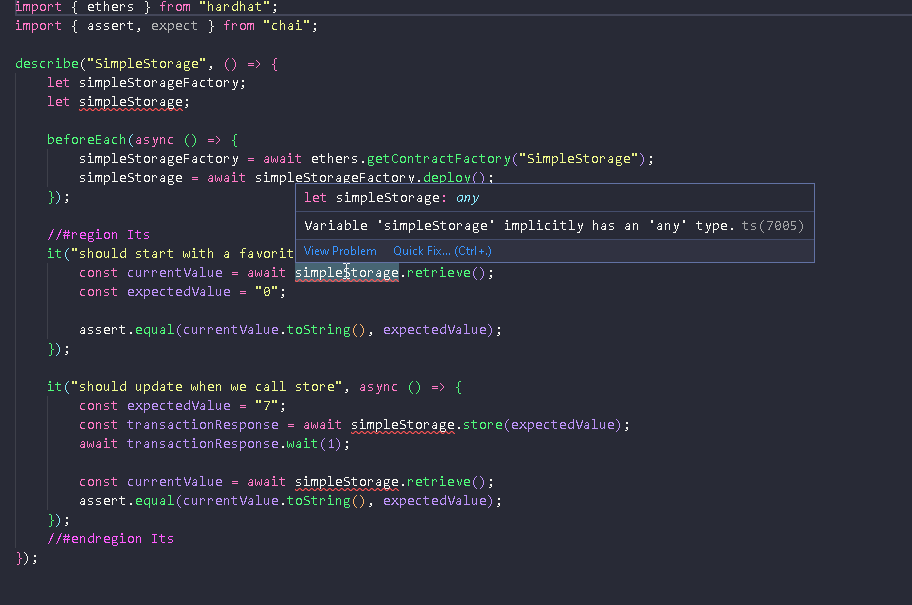

# 008_Lesson6HHSimpleStorage_Typescript

- in this lesson we pickup where we left of on `008_Lesson6HHSimpleStorage`, but will be turning this into a typescript project

- this part starts at about 09:50:00 in the [youtube video](https://www.youtube.com/watch?v=gyMwXuJrbJQ)

- we just made all our dependencies, dev-dependencies, because thats really what they should be...but then got a ton of errors so ended up just copying this from Patrick's github:

    ```json
	"devDependencies": {
		"@nomiclabs/hardhat-etherscan": "^3.0.0",
		"@nomiclabs/hardhat-waffle": "^2.0.2",
		"chai": "^4.3.4",
		"ethereum-waffle": "^3.4.0",
		"ethers": "^5.0.0",
		"hardhat": "^2.8.3",
		"hardhat-deploy": "^0.9.29",
		"hardhat-deploy-ethers": "^0.3.0-beta.13",
		"hardhat-gas-reporter": "^1.0.7",
		"solidity-coverage": "^0.7.18"
	},
	"dependencies": {
		"@chainlink/contracts": "^0.3.1",
		"@nomiclabs/hardhat-ethers": "^2.0.4",
		"@typechain/ethers-v5": "^9.0.0",
		"@typechain/hardhat": "^4.0.0",
		"@types/chai": "^4.3.0",
		"@types/mocha": "^9.1.0",
		"@types/node": "^17.0.13",
		"dotenv": "^14.2.0",
		"prettier-plugin-solidity": "^1.0.0-beta.19",
		"ts-node": "^10.4.0",
		"typechain": "^7.0.0",
		"typescript": "^4.5.5"
	}
    ```

- we converted `.js` files into `.ts` files including:

    - `./hardhat.config.js`
    - `./scripts/deploy.js`
    - ``
    
- we created our `tsconfig.json` in our `root` with whatever options Patrick had -- can change this later

    ## Deploy.ts
    
    - change the `require()` statement at the top to `import`
        - `ethers` will be missing, so we need to fix our `hardhat.config.ts` file with `import` statments as well to get it to go away -- to be more explicit we will also just add it to the `hardhat.config.ts` explicitly
        
    - add `types` to `params` in `functions`
    
    
    ## block-number.ts
    
    - made `default` export
    
    - changed from `require` to `import`
    
- now we should be able to run like normal

- but with testing it gets a little weird

    ## test-deploy.ts
    
    - renamed from `test-deploy.js` to `test-deploy.ts`
    
    - **it's weird here because if we call a function on `simpleStorage`, typescript can't know the functions that exist for our `.sol` contract**
    
        - 
        
    - this is why we installed `"@typechain"` plugins in our `devDependencies`:
        - `typechain`
        - `@typechain/hardhat`
        - `@typechain/ethers-v5`
        
    - this will allow us to generate types for our contrats so Typescript doesn't yell at us
    
    - once you have included the `@typechain` plugins in your `hardhat.config.ts` you can see they are working by typing `npx hardhat` which will now have a new option...`typechain`
    
    - running `npx hardhat typechain` will generate a new folder called `typechain-types` in your `root` folder with types for our contracts
    
        - for example: you can look in the `./typechain-types` folder and see the `SimpleStorage.ts` file that we generated for our `SimpleStorage.sol` contract
        
            - make sure you add these to your `.gitignore` file
            
    - finally just include this in your `test-deploy.ts` file and then define the types:
        ```ts
        import { SimpleStorage, SimpleStorage__factory } from "../typechain-types/";

        describe("SimpleStorage", () => {
            let simpleStorageFactory: SimpleStorage__factory;
            let simpleStorage: SimpleStorage;

            beforeEach(async () => {
                simpleStorageFactory = (await ethers.getContractFactory(
                    "SimpleStorage"
                )) as SimpleStorage__factory;
                simpleStorage = await simpleStorageFactory.deploy();
            });
        ```