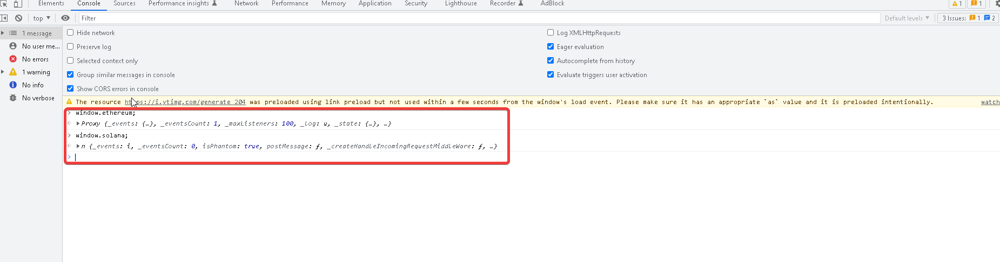
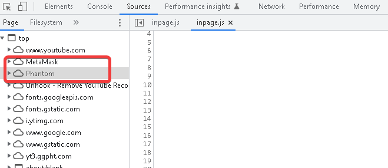
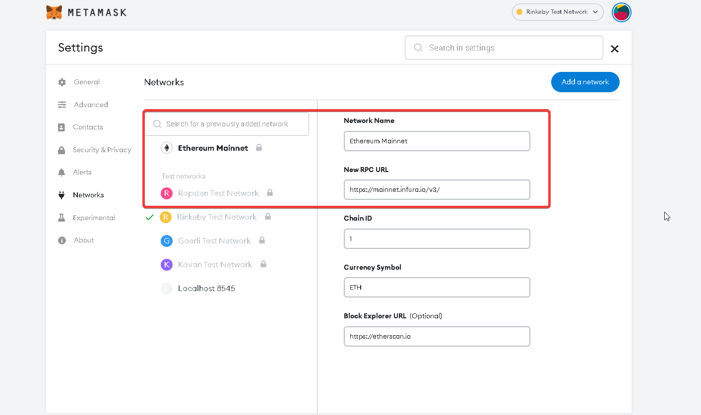
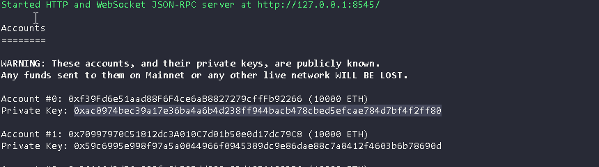
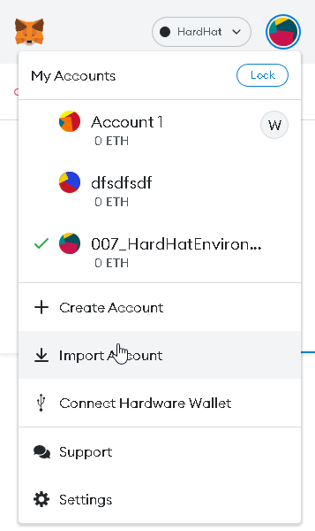

# 010_Lesson8_HardhatFundMeFrontEndWebpage

- here we basically create a wrapper for the contracts we created in the last lesson

- because this is really easy, I'm only going to be taking notes about stuff I found interesting/useful and not neccessarily writing the whole exmaple from scratch

    ## Accessing Metamask, Phantom, Web3 Wallets

    - if you head into your chrome js console and type `window.ethereum;` or `window.solana;`, you will see a response if you have a wallet for each of those, without one, you will just see `undefined`
    
        - 
        
    - this appears because in the `sources` tab of the `console`, you can see both `MetaMask` and `Phantom`
    
        - 
        
    - if you wanted to create a webpage that connected with them, you could simply write js to check if they exist and then connect... check out the simple example at [WalletConnect.html](./examples/WalletConnect/WalletConnect.html)
    
        - btw if you just want to quick see it, just open in `Live Server` on `VScode`
        
    ## WorkingWithEthers
    
    - ethers.js is the library that hardhat uses as well
    
    - in the example [WorkingWithEthers](./examples/WorkingWithEthers/WorkingWithEthers.html), you can see how we put all our js in `WorkingWithEthers.js` and imported it into `WorkingWithEthers.html` using a `script` tag with the `module` type
    
    - in the module, we imported the `ethers-5.2.esm.min.js` file, which is the module that ethers suggests you use in projects that are static like so
    
    - if we `console.log(ethers)` we can see all that we get with it running
    
    - to wrap around metamask, we use this `Web3Provider` line and give it the `Source` we need it to wrap around...
        ```js
        const provider = new ethers.providers.Web3Provider(window.ethereum);
        ```
    
    - when we do this, `ethers.js` will grab the RPC Endpoint that your wallet is using
    
        - you can see these in Metamask by looking at your networks:
        
            - 
            
    - so now you can get other things like the signer by just using the provider:
        ```js
        const signer = provider.getSigner();
        ```

        ### Adding Hardhat
        
        - to actually use hardhat with our front end, we need to add support for the local node in our metamask
        
            - we can do this by simply adding a network and entering:
            
                - Network Name: Hardhat (or whatever, this just for you)
                - RPC URL: http://127.0.0.1:8545
                - Chain ID: 31337
                - Currency Symbol: ETH
                - Chain Explorer: null
                
                - make sure you have `npx hardhat node` running, otherwise you might see errors on metamask, like the chain id being wrong
                
        - next, if we actually want to sign with our accounts, we also have to import them into our provider, you can do this by just grabbing the private key from the console and importing it into metamask
        
            - 
            
            - 
            
        ### Interacting With The Contract
    
        - finally to interact with the functions of our contract, we need to import an `abi` and `address`
        
        - we can get both of these from our compiled contracts in the `artifacts` folder, in the `.json` file of the contract folder
        
        ```json
        "abi": [
            {
            "inputs": [
                {
                "internalType": "address",
                "name": "priceFeedAddress",
                "type": "address"
                }
            ],
            "stateMutability": "nonpayable",
            "type": "constructor"
            },
            {
            "inputs": [],
            "name": "NotOwner",
            "type": "error"
            },
            {
            "stateMutability": "payable",
            "type": "fallback"
            },
            {
            "inputs": [],
            "name": "MINIMUM_USD",
            "outputs": [
                {
                "internalType": "uint256",
                "name": "",
                "type": "uint256"
                }
            ],
            "stateMutability": "view",
            "type": "function"
            },
            {
            "inputs": [
                {
                "internalType": "address",
                "name": "",
                "type": "address"
                }
            ],
            "name": "addressToAmountFunded",
            "outputs": [
                {
                "internalType": "uint256",
                "name": "",
                "type": "uint256"
                }
            ],
            "stateMutability": "view",
            "type": "function"
            },
            {
            "inputs": [],
            "name": "fund",
            "outputs": [],
            "stateMutability": "payable",
            "type": "function"
            },
            {
            "inputs": [
                {
                "internalType": "uint256",
                "name": "",
                "type": "uint256"
                }
            ],
            "name": "funders",
            "outputs": [
                {
                "internalType": "address",
                "name": "",
                "type": "address"
                }
            ],
            "stateMutability": "view",
            "type": "function"
            },
            {
            "inputs": [],
            "name": "i_owner",
            "outputs": [
                {
                "internalType": "address",
                "name": "",
                "type": "address"
                }
            ],
            "stateMutability": "view",
            "type": "function"
            },
            {
            "inputs": [],
            "name": "priceFeed",
            "outputs": [
                {
                "internalType": "contract AggregatorV3Interface",
                "name": "",
                "type": "address"
                }
            ],
            "stateMutability": "view",
            "type": "function"
            },
            {
            "inputs": [],
            "name": "withdraw",
            "outputs": [],
            "stateMutability": "payable",
            "type": "function"
            },
            {
            "stateMutability": "payable",
            "type": "receive"
            }
        ]
        ```
        
        - lets make a new file called `constants.js` and paste this in there so it doesnt waste our js file space, then import it in our `WorkingWithEthers.js` file
        
        - finally how do we get the address?
        
            - as soon as we spin up our node, our deploy script should run and tell us the address where our FundMe Contract was deployed to, which we just copy and put into our `constants.js` file like:
            
                - `export const contractAddress = "0x..."`
            
            
                - finally we just add the `contractAddress`, `signer`, and `abi` to our `WorkingWithEthers.js` file && call the function like:
                    
                    ```js
                    const contract = new ethers.Contract(contractAddress, abi, signer);
                    
                    const transactionResponse = await contract.fund({
                        value: ethers.utils.parseEther(ethAmount),
                    });
                    ```
                
                - note the value key of the object is the amount of ether we are sending to the contract, you will see this keyword alot even if the function doesn't explicitly ask for it
                
        > note, if you get a weird nonce error in metamask, it's because you restarted your local node and the nonce's are off, just go ahead and look for the "Reset Account" button in metamask settings on the account page
        
        
        ### Listening For Events With Contracts
        
        - now that our first transaction ran, lets clean it up a lil, we can change our frontend and show confirmation of an event using two things:
            
            1. listen for tx to be mined
            2. listen for an event to be emitted
            
        - lets do the first one first with a new method called `listenTX()`